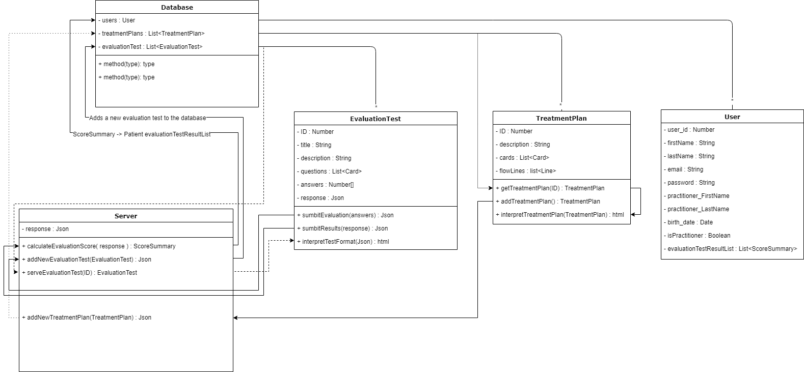
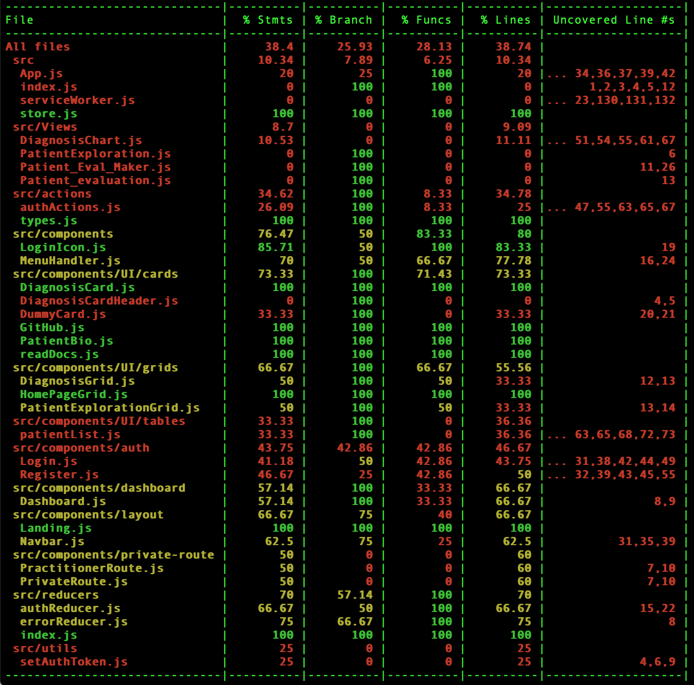

# How to Setup the PsychGH Project

## Getting the Project

To get the latest, stable version of the PsychGH project, just run
`git clone https://github.com/TostySSB/psychgh.git`.

## Project Layout

After cloning the repository, you will see that we have two primary folders
in our project: `client` and the root directory.
 -  `/client` contains the react application, so aptly named "client"
    -  `/public` contains all of the bootstrapping code for the React application.
    -  `/src` contains all of PsychGH's logic, components, and style sheets.
    -  `/docs` contains all of the files for the user and developer documentation.
 - `root` this folder is not named root, but instead refers to the root directory. This contains the Express backend application. This is responsible for all of the routing done by the client

## Install Node.js

Navigate to Node.JS's [download page](https://nodejs.org/en/download/current/) and download the appropriate installer for your system. Follow the instructions provided by the installer to fully install Node.js and NPM.

## Working with PsychGH

To run PsychGH in development mode, from within the root directory, use the command `npm install` to install all of the dependencies for the express server.Then navigate to the client directory in a new terminal window and use the command `npm install` to install the client's dependencies. 

Then, from within the 'root' directory, execute the command `npm run dev`. This runs both the express server and the react client concurrently. A browser window will open up to `http://localhost:3000`. This will allow you to view the app running. As you make edits,
this page, as well as the express server, will reload. Linter errors will appear in the developer console.

To test PsychGH, use the command `npm test` in the project directory to launch the test runner. Since we are using React's built-in test runner, see [Facebook's
documentation](https://facebook.github.io/create-react-app/docs/running-tests)
for more information. Automated tests are setup to be run via Travis, and all configuration for Travis can be found in your `.travis.yml` file.

To build PsychGH, use the command `npm run build` from within both the root and the client directory. This builds the app and places the production ready code into the `build` folder it creates inside the project. This command builds optimized and minified javascript that is ready
to be deployed to the live site.

## Acessing Bug Reports

Visit our [issues site](https://github.com/TostySSB/psychgh/issues) to see a
list of currently open issues.

## Technologies used

- [NodeJS](https://nodejs.org/en/) [`Package Manager`]
   - NodeJS is the package manager of choice for PsychGH, though pip and other means of installing dependencies should work just fine aswell
- [React](https://reactjs.org/) [`Framework`]
   - React is our `JavaScript Library` we chose to use for building the front end UI. We chose react for its ease of use and component-based nature.
- [Express JS](https://expressjs.com/) [`Framework`]
   - Express acts as our `middleware` to verify calls to the database are made by users with the apropriate authority, and to add a layer of security by not directly accessing our database from our application's front end
- [MongoDB](https://www.mongodb.com/) [`Data Base`]
   - We use mongoDB as our database for storing both `practitioner` & `patient` data, as well as all the data required for the psychiatric guide
- [PassportJS](http://www.passportjs.org/) [`Authentication`]
   - PassportJS is what we use to handle `user authentication` and verify routing using `tokens`
- [StoryBook](https://www.learnstorybook.com/react/en/simple-component/) [`Component debugging`]
   - We use `storybook` for testing individual components as we make them, to ensure they work atleast before being added to the larger project. To `use` story book, `cd` into the stories directory in `client` and run the command `'yarn run storybook'`.
- [Jest](https://jestjs.io/) [`Test Cases`]
   -For unit test cases, we use `Jest`, the javascript testing framework that is built into the `creat-react-app` command we used to start this project.

## UML Diagram of the Server-Database structure

## Debugging Coverage at present:

## User Testing
Post feature release, we decided to have some actual would be users test the application.

User Profiles:
- `User 1:`
	- Full name: Karen Solberg
	- Occupation: Student (Mathematics Major Junior year)
- `User 2:`
	- Full name: Harold Oster
	- Occupation: Infectious disease specialist/general practitioner (Doctor)

**Their Tasks:**

      We asked User 1 to approach the website as a patient. This would include signing up as a patient and checking if they needed an evaluation test, then taking one if necessary. After this simple task, they would be free to explore around the website and try and tell us what features we had implemented for patients to use, thus allowing us to figure out what he was able to figure out intuitively.

      Meanwhile, we asked User 2 to joining the website as a practitioner, which includes signing up normally, then being verified by us as a practitioner before he could have practitioner privileges. After that, he would be tasked with evaluating a patient’s progress and diagnosing the appropriate methods of treatment. Please note, User 2 is a doctor, so they should approach this similarly to how a psychiatric practitioner would in the field. They would then be free to explore what practitioners have access to on the website and tell us what features there were available to him, thus allowing us to figure out what he was able to figure out intuitively.

**User’s Evaluation:**

- User 1
   - Took awhile to find the login page due to the login button being hidden behind a menu button
   - realized they had to register before logging in, and proceeded to do so without any problem
   - Took the evaluation test and submitted the results, though some of the test results were not reported correctly. 
   - Logged out
   - The ‘patient’ understands they can:  View their account, take depression evaluation tests, and log out.

- User 2:
	- Also took awhile to find the register/login page
   - Signed up successfully, we approved them as a Practitioner, & they gained access rights immediately.
   - Was able to add a specific patient just fine, and check their information
   - Was able to navigate to the depression diagnosis chart just fine & decide the next steps in the patient’s treatment accurately.
   - “The Diagnosis page looks bad” (It was a temporary implementation meant to be replaced)
   - Was able to edit the evaluation test
   - ”Wait, I really have to remake everything in the evaluation test each time I edit it?”
   - Was able to edit the diagnosis page with some difficulty.
   - The ‘practitioner’ understands they can: view my patient’s details, Add patients to my patient list, Search for a specific patient, view depression test evaluation results on a patient by patient basis, edit depression test & how it is evaluated.

**What we learned from them:**
- The main page is good for developers, but not so much for general Users right now.
- The header bar should have a series of buttons that are currently under the drop down style menu button. This should be changed for improvements in simplicity of design.
- The depression treatment plan page needs major revamping.
Normal Patients want to be able to view their own data.
They liked the minimalist design, and how simple we kept things.
- The editability of evaluation tests needs improvement.

**What we changed as a result:**
- The header bar now has a series of buttons inplace of a drop down menu.
- Remade the depression treatment plan page, basically redoing that function entirely
- Added ability for patient to view account information
- Updated evaluation tests to report correct values to the database
